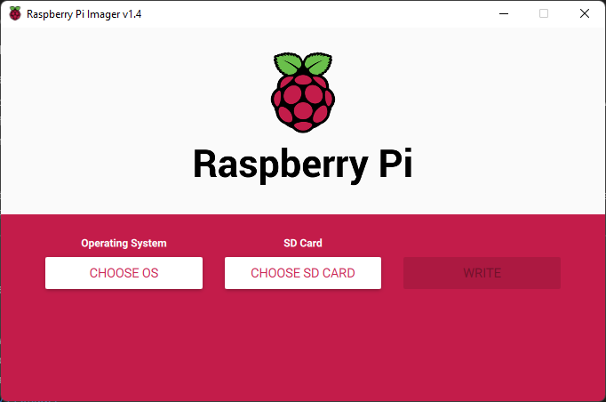
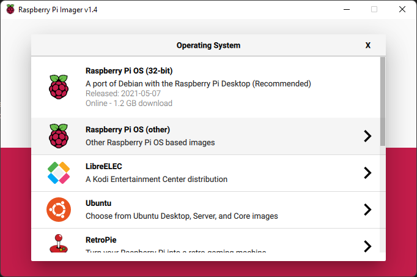
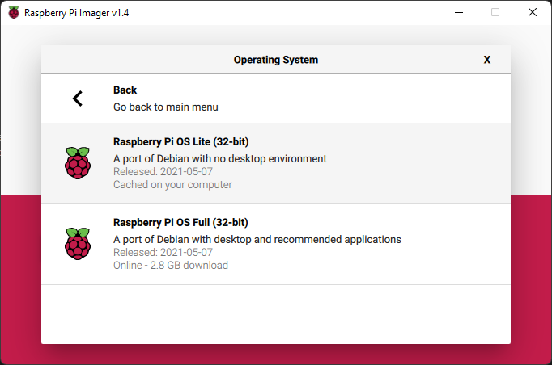
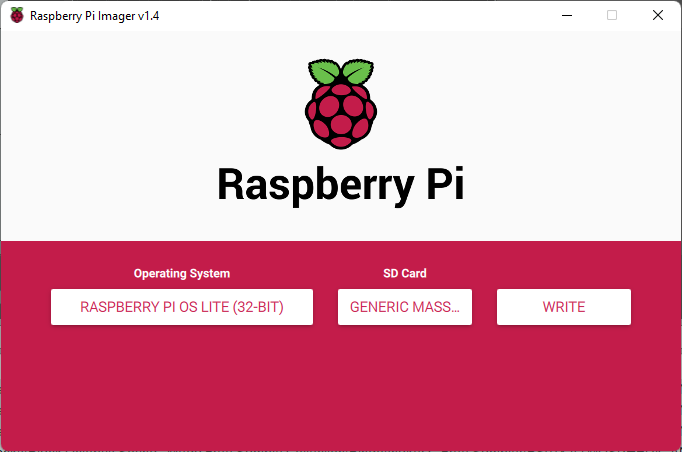
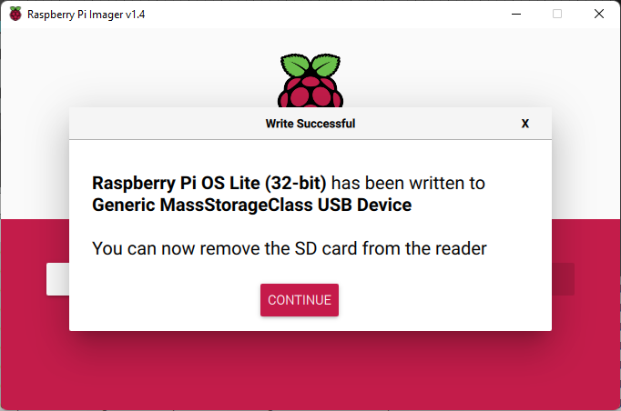
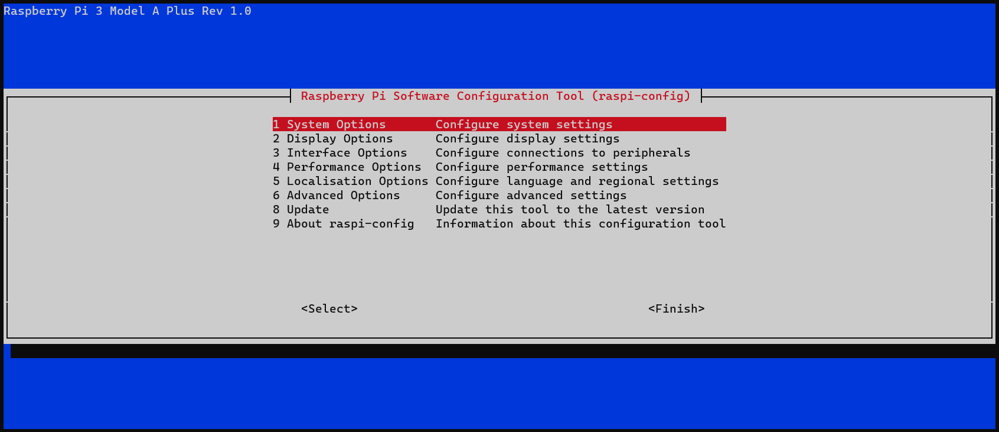
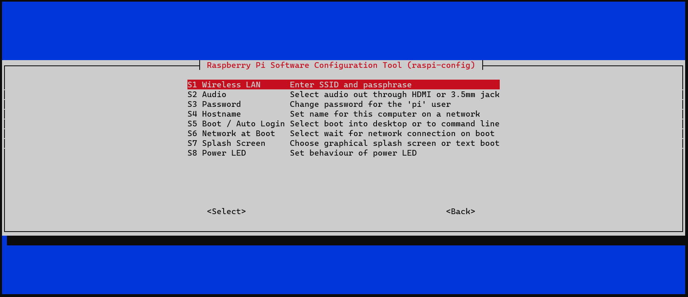
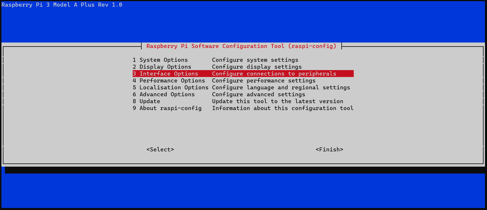
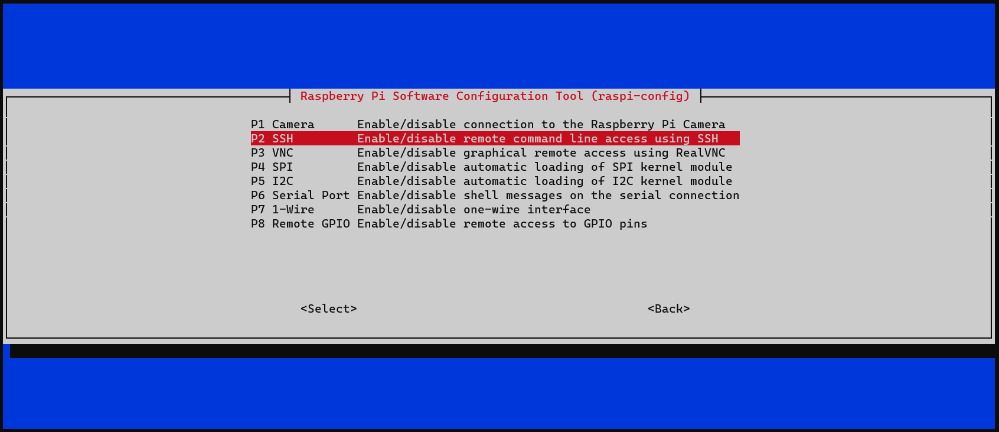

# Pistorm Big FAQing Guide

## What is PiStorm?

Pistorm is a CPU accelerator platform that emulates Motorolla 68000 series of CPUS via software running on a Raspberry Pi. It is designed to replace an existing processor.

---

## What does it work with?

### Supported Target Hardware:

    Amiga 500, 500+, 1000 and 2000.

### Unsupported Target Hardware

Because its emulating a 68000 and pin compatible, it is possible it will work on other systems, but thats, as the title states, unsupported at this moment. There are reports of it working on an A600, CDTV and Atari ST systems and AppleMacs are something the community is investigating.

### Supported Raspberry Pis

* Model 3A+
* Zero 2

### Slightly Supported Raspberry Pis

* Model 3B+ - works but wont fit in a 500. If you can resolve this (either with a case, extender or desoldering ports) it should be fine.

### Non supported Raspberry Pis

* Model 1/2 families - Too old.
* Zero 1/ ZeroW - Too old.
* Model 4 family - there will be a new Pistorm for this later.

---

## PiStorm software

There are two options for software stacks on PiStorm:

### Classic / Masashi

The classic setup sits on top of a Linux distro, and thus has a slowish startup and comes with some performance penalties. However, sitting on top of Linux means a lot of comfort features like networking. If you are starting out or havent used an Amiga for a while/forever, this is the recommended approach.

### Emu68

Emu68 is the future of PiStorm - but is in "early" days. It is a bare metal system, no overhead of an OS - but also none of the benefits. It's currently VERY fast and supports a few nice to haves like SD Partition support and RTG but no networking.

---

## Setting Up

### Setting up Classic

You will need:
*   PiStorm with Raspberry Pi Attached
*   MicroSD of at least 8GB (bigger recommended - to store HD Images)
*   An Amiga with said PiStorm attached
*   [Raspberry Pi Imager](https://www.raspberrypi.com/software/)
*   A USB Keyboard
*   A monitor connected to the PI

#### Writing the SD

Open the Raspberry PI Imaging Software:



Select `CHOOSE OS` and select `Raspberry PI OS (other)`



Then select `Raspberry Pi OS Lite (32-bit)`



Select your SD Card and hit `WRITE`



Writing will take a little while, so now is a fantastic time for a coffee break.

Once writing is complete, place the SD in the Raspberry Pi



The Pi should now boot into Linux. 
Once it has booted, log in with the default username and password:

```
raspberrypi login: pi
Password: raspberry
```

type 

`sudo raspi-config` 

and select 

`1 System Options`


Select

`S1 Wireless Lan`


and select your country.

Now enter the SSID of your wifi network.

Now Enter the Password of the network.

It will now return you to the main menu.

Select `3 Interface Options`


Select `P2 SSH`



Select `Yes`

Exit raspi-config and reboot when it asks you to.
In theory, from this point on you should be able to ssh in to the pi and do everything remotely.
You should be able to get the IP from the pi; log in and run either `ip addr` or `ifconfig` and look for the ip under wlan0.


### Setting up Emu68

---

## Harddrives

### Setting up Harddrives in Classic

### Setting up Harddrives in Emu68

